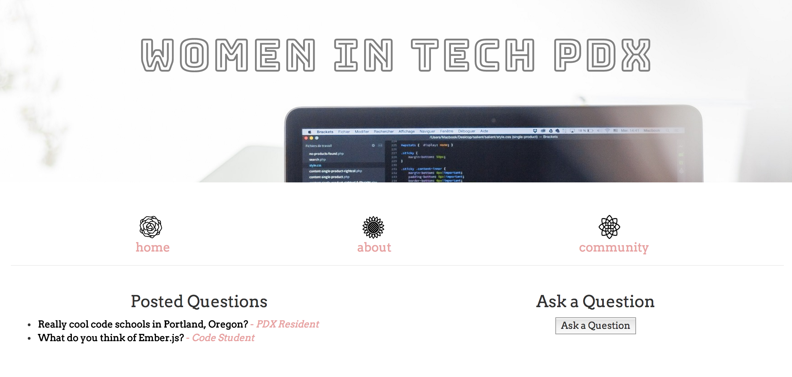
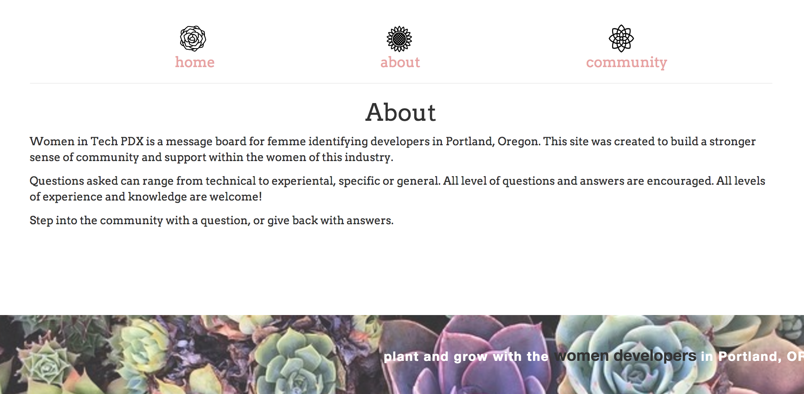

# message-board

#### Sara Schultz, 06.02.2017

The second solo JavaScript project at Epicodus was to build an Ember.js message board application. This application is created specially for femme identifying developers in Portland, OR. The application allows the user to enter questions, as well as answer questions of the other developers in their community. It also serves as a resource for women in tech to connect to meet ups and grow in knowledge.

## Specs

| Behavior                   | Input Example     | Output Example    |
| -------------------------- | -----------------:| -----------------:|
|A user can submit a question| Question: What is a good code school in Portland?, Author: PDX Resident, Additional Notes: I'm looking to start next month.| What is a good code school in Portland?, PDX Resident displayed on homepage.|
|A user can answer a question after clicking it on the homepage| Answer: Epicodus is great! Author: Epicodus Student| Answer displayed on specific questions page|
|A user can update their question|Question: What is a good code school in Portland?|Question: What is a good code school in downtown Portland, OR?|

## Prerequisites

You will need the following things properly installed on your computer.

 * [Git](https://git-scm.com/)
 * [Node.js](https://nodejs.org/) (with NPM)
 * [Ember CLI](https://ember-cli.com/)
 * [PhantomJS](http://phantomjs.org/)

## Installation

 * `git clone <https://github.com/saschultz/Message-Board.git>` this repository
 * `cd message-board`
 * `npm install`

## Running / Development

 * `ember serve`
 * Visit your app at [http://localhost:4200](http://localhost:4200).

## Known Bugs

None known.

## Support/Contact Details

For support or questions contact Sara: saschultz8@gmail.com

## Technologies Used
* HTML
* CSS, Bootstrap
* JavaScript
* Node.js
* Ember.js

### License

This software is licensed under the **_MIT License_** Copyright (c) 2017 Sara Schultz
